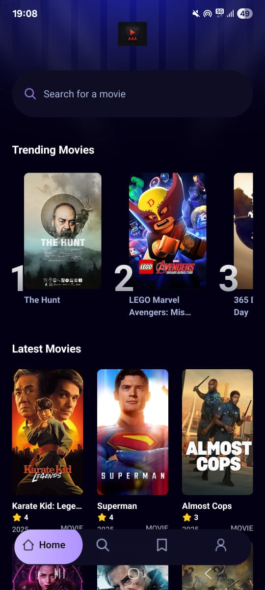
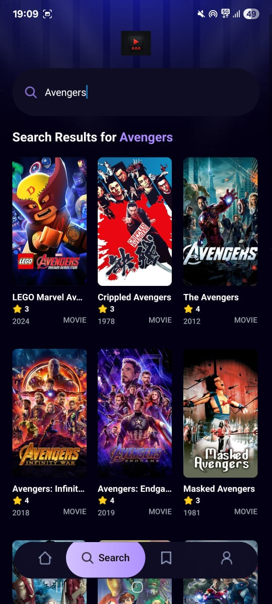

# 🎬 AAA Movie App

Welcome to the **AAA Movie App**, a modern and visually engaging React Native application built for discovering and exploring movies. It provides users with a streamlined experience to browse trending films, search by title, and view detailed movie information — all from a clean mobile interface.

## 📱 Features

### 🔸 Home Screen

- 🔎 **Search Bar** – Search for movies by name.
- 🚀 **Trending Movies** – See what’s hot right now.
- 🆕 **Latest Movies** – Get the latest additions with ratings and posters.
- 🔄 **Bottom Tab Navigation** – Quickly switch between Home, Search, Bookmarks, and Profile.

### 🔸 Search Screen

- 🔍 Search movies dynamically by keyword.
- 🎞 Movie cards display with posters, ratings, release year, and type.
- 📱 Fully scrollable results layout.

### 🔸 Movie Details Screen

- 🎬 View full movie poster and detailed metadata (title, year, duration).
- ⭐ Star rating system with vote count.
- 📖 Full overview/description of the movie.
- 🔙 Easy back navigation to return to the previous screen.

---

## 📸 Screenshots

### 🎬 Home Screen  


### 🔍 Search Results Screen  


### 🎥 Movie Details Screen  


---

## ⚙️ Tech Stack

- **React Native** + **Expo**
- **JavaScript** (with hooks and modern syntax)
- **React Navigation**
- **Tailwind CSS (NativeWind)**
- **REST API Integration** (e.g., TMDB or a mock API)

---

## 🧪 Getting Started

### 🚀 Run Locally

```bash
# Clone the repository
git clone https://github.com/adi-ensei/AAA_movieapp.git

# Navigate to the project directory
cd AAA_movieapp

# Install dependencies
npm install

# Run the app using Expo
npx expo start
